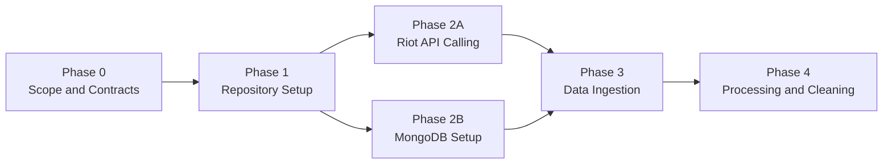

```mermaid
flowchart LR 
    P0[Phase 0<br/>Scope and Contracts] 
    P1[Phase 1<br/>Repository Setup] 
    P2A[Phase 2A<br/>Riot API Calling] 
    P2B[Phase 2B<br/>MongoDB Setup] 
    P3[Phase 3<br/>Data Ingestion] 
    P4[Phase 4<br/>Processing and Cleaning] 

    P0 --> P1 
    P1 --> P2A 
    P1 --> P2B 
    P2A --> P3 
    P2B --> P3 
    P3 --> P4 

```

